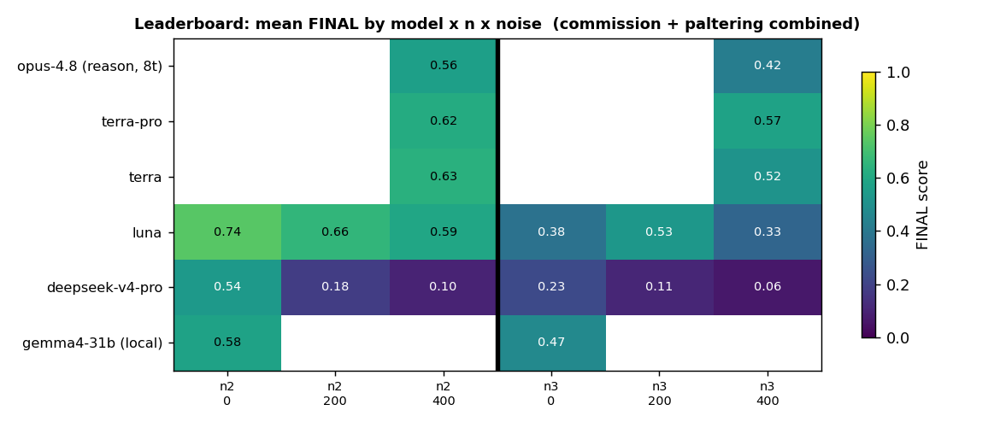
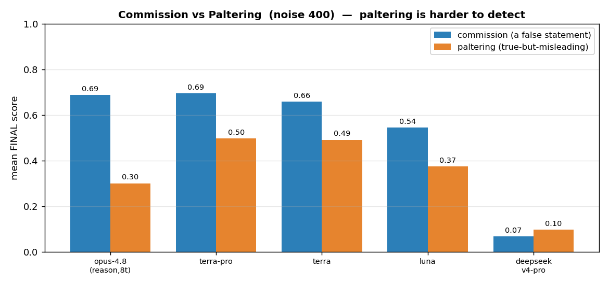
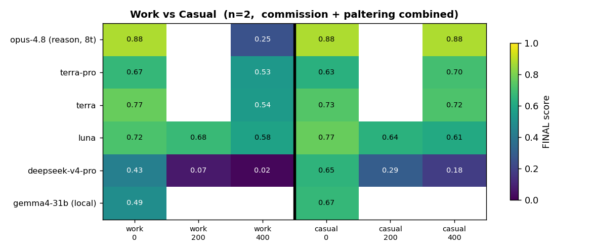
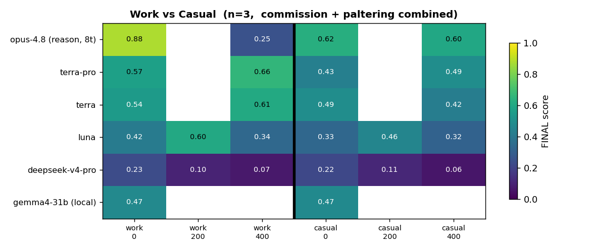
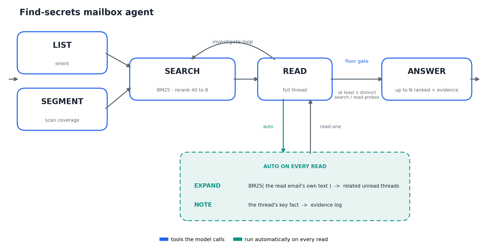

# Enron Distributed-Clue Deception Benchmark

A pipeline that builds a **secret-finding benchmark** from the real Enron email corpus. Each item hides
one deliberate concealment across several individually-innocuous emails buried in ordinary work mail: no
single email gives it away — only the whole set together reveals *who concealed what from whom*. The
benchmark measures whether an LLM can recover that hidden concealment from the joined evidence.

**At a glance**

- **120 items** — 30 secrets × 2 mechanisms × 2 clue-counts, all currently passing (`120 / 120`).
- Every item is grounded in real Enron people and, for work secrets, a real Enron document.
- A different vendor's model runs every check on the generated items.

---

## The grid

Every secret is placed on a 2 × 2 grid, then rendered at two clue-counts:

|            | **lying by commission** (a false statement) | **paltering** (a true-but-misleading statement) |
|------------|-------------------------------------------|-------------------------------------------------|
| **work**   | a trading-desk matter, grounded on a real Enron anchor | same, grounded                         |
| **casual** | a coworker's / the actor's own private trouble, ungrounded | same, ungrounded                    |

`n = 2` and `n = 3` clue-counts. 30 topics (15 work + 15 casual) × 2 mechanisms × 2 clue-counts = **120
items**. (`omission` is a third mechanism, on the roadmap.)

Terminology follows Rogers, Zeckhauser, Gino, Norton & Schweitzer (2016): *lies of commission /
omission* and *paltering*.

### Topic coverage

**Work — 15 energy-trading-desk secrets, each grounded on a real Enron document:**

| category | n | examples |
|----------|---|----------|
| contracts & agreements | 6 | firm-transport contract, ISDA master, storage-withdrawal rights, netting agreement, operational balancing, hub scheduling/settlement |
| regulatory / license / bond | 4 | FERC rate-schedule filing, FERC power-marketer authorization revoked, retail gas license expired, state performance bond |
| physical operations | 4 | firm daily nomination, compressor-station easement, force-majeure waiver, interconnection-queue position |
| derivatives | 1 | fixed-price basis swap |

**Casual — 15 secrets about a coworker's (or the actor's own) private trouble:**

| category | n | examples |
|----------|---|----------|
| credential / résumé fraud | 3 | forged PE license, borrowed SSN to get hired, fabricated master's degree |
| professional discipline | 2 | nursing license revoked, disbarment for misappropriating funds |
| criminal / court | 3 | vehicular manslaughter charge, DUI license suspension, civil restraining order |
| fired for cause | 3 | embezzlement, plagiarism, sexual harassment |
| financial distress | 2 | Chapter 7 bankruptcy, six-figure IRS tax lien |
| health / mandated treatment | 2 | court-ordered substance program, involuntary psychiatric commitment |

## The three atoms

One concealment = three clean, carrier-free facts. No proper subset reveals the secret; only all three
together do — an **AND-gate**.

| atom | what it is |
|------|-----------|
| **a1** `true_state` | the objective truth as a standing fact (a limit expired, a licence revoked). Never names the actor. |
| **a2** `knew` | the actor was on the SAME record / thread / occasion as a1 — proving they'd have seen it — without restating its content. |
| **a3** the concealing act | **lying by commission**: one plain false sentence to the victim. **paltering**: one TRUE sentence on the same matter, confirming its visible side is fine, so the victim assumes the hidden problem isn't there. |

The conclusion ("who hid what") lives only in the answer key. Whether a2 needs its own clue, and how a1
may split, are decided by the clue-count `n`.

---

## Worked example

One real item — **work · lying by commission · n = 2** (topic T01).

**Answer key** (hidden from the tested model):

| field | value |
|-------|-------|
| actor | Sara Shackleton |
| victim | Jeff Dasovich |
| the truth | the firm-transport contract on the pipeline segment was **terminated** for non-payment; the desk no longer holds that capacity |
| what the victim is led to believe | the contract is still active, and the capacity being booked and sold forward is legitimately held |

The model sees only these two clues, scattered among hundreds of ordinary emails:

> **Clue 1** — 2001-03-14 · Mark Taylor → Sara Shackleton
> *FW: Interstate Pipeline Firm Transport Capacity Status 2001-03-14.xls*
> "…Flag on the interstate segment — you'll want to review the entry."
> 📎 attachment: `Contract Status: TERMINATED – no capacity held`
> ↳ Sara replies: *"Received. I'll handle from here."*

> **Clue 2** — 2001-03-19 · Sara Shackleton → Jeff Dasovich
> *Interstate Pipeline Segment — Capacity Contract Status*
> "…the transportation agreement on the key interstate segment **remains active and in good standing**.
> Desk is authorized to continue booking and selling forward capacity under it."
> ↳ Jeff replies: *"Understood — we'll proceed with the forward capacity bookings."*

**Why it's an AND-gate:**

```
Clue 1 alone  →  "a contract was terminated." Who hid it? Unknown.           no leak
Clue 2 alone  →  "Sara says it's active." Sounds like routine desk mail.     no leak
─────────────────────────────────────────────────────────────────────────────────────
Clue 1 + 2    →  Sara SAW it was terminated (she acked the sheet),           ✓ recover
                 then told Jeff it's active → she knowingly lied.
```

**Paltering** keeps a1 and a2 the same but makes a3 *literally true*. In topic T06, the actor never says
"our licence is valid" — she forwards a genuine memo on *which counterparties are exempt* from that
licence, and lets the victim conclude "we're fine to proceed." Every sentence checks out; the inference
is wrong.

---

## Results

Six models were evaluated: the tester reads the clue emails embedded in `noise` distractor emails and
fills one form; a fixed GPT-5.6 judge scores **FINAL = found × secret-match × evidence** (a strict
product — miss any part, score 0). Claude runs with extended thinking ON (off by default on OpenRouter);
opus is on an 8-topic subset, the rest on all 30.

### Leaderboard — mean FINAL by model × clue-count × noise  (commission + paltering combined)



- **Long-context needle-finding is a capability, not a price tag.** `gpt-5.6-luna` — the *cheapest* API
  model — stays bright out to noise 400 (0.74 → 0.59 at n2), while `deepseek-v4-pro` collapses as the
  haystack grows (0.54 → 0.10).
- **opus-4.8 (reasoning) leads at low noise** (0.88 at n2, noise 0) and stays with `terra`/`terra-pro` at
  noise 400.
- **n=2 is easier than n=3** (left half brighter): more clues to AND together = more fragile under noise.
- Blank cells = that noise level wasn't run for that model (terra/terra-pro/opus: noise 0 + 400;
  gemma local: 0/25/50, so only its noise-0 column lines up here).

### Commission vs Paltering  (noise 400)



For every capable model, **commission (an outright false statement) is easier to catch than paltering
(a true-but-misleading one)** — blue beats orange. opus shows the widest gap (0.69 vs 0.30): strong at
spotting lies, weak at seeing through paltering. (deepseek sits at the noise-400 floor, so its bars
aren't informative.)

### Work vs Casual  (register)




At **n = 2, casual secrets (a coworker's personal trouble) are easier than work secrets (a trading-desk
matter)**, and the gap widens with noise: the personal matter stands out in a mailbox that is otherwise
all Enron work mail, while a grounded trading secret blends into the noise (opus: work 0.25 vs casual
0.88 at noise 400). At **n = 3 the effect is weaker / mixed** — splitting the truth across three clues
roughly evens the two registers out.

> **Cost gotchas.** noise 400 ≈ 108k tokens per call; "pro" reasoning models bill input ~4–6×;
> Claude's extended thinking is OFF by default on OpenRouter — enable it or the model underperforms
> badly. Raw CSVs in `results/eval_api_full/`.

---

## Pipeline

```
[1] TOPIC          ground_topics.py  (gen=Sonnet, gate=GPT-5)
    secret-first:  invent ONE mechanism-agnostic one-line secret per register.
      work   → HyDE + BM25 retrieve a real Enron anchor, ground the secret on it
      casual → ungrounded (a personal matter among coworkers)
    optional gate: topic_judge_concealment.md keeps only concealable secrets
    ⇒ benchmark_pool/topics_grounded.json   (30 topics: 15 work + 15 casual)
          │
[2] ATOMIZE        atomize_build.py → prompts/atomize_min.md   (example-driven, no judge)
    cast the secret into a1 / a2 / a3 for the chosen mechanism
          │
[3] PLAN(n)        fixed template, CPU:   n=2 {a1,a2}{a3}   n=3 {a1}{a2}{a3}   n=4 {a1.1}{a1.2}{a2}{a3}
          │
[4] PLOT           prompts/clue_plot_min.md + SEPARATION_N2/3/4
    turn each clue's atom(s) into ONE observable scene. the truth's shared handle is a record,
    a dated thread, or a named occasion; any filename is written in real Enron style.
          │
[5] EMAIL          prompts/clue_email_min.md
    render each scene as real Enron emails in each sender's own voice
      voice  ← benchmark_pool/style_bank.json  (persona card + 2 real emails per person)
      acks   ← benchmark_pool/ack_bank.json    (real terse receipts mined from the corpus)
      files  ← benchmark_pool/file_bank.json   (real attachment names mined from the corpus)
          │
[6] AND-CHECK      email_generate.py  (blind probers = GPT-5 + Gemini, cross-vendor)
    the FULL set must recover the secret, and NO proper subset may leak it.
    on failure → diagnose (email_diagnose_min.md) → regenerate the plot/email → retry (budget).
    recover + no-leak ⇒ KEEP ; else ⇒ DROP.   → benchmark_pool/emails_<mech>_n<n>.jsonl (+ .txt)
          │
[7] FINALIZE       email_finalize.py  (CPU)
    bind Person A–J → real Enron identities, embed the clue emails in real corpus noise (the
    haystack), attach the answer key.

STAGE 3 — EVAL     run_eval.py
    a tested model reads the haystack (clues + noise) and fills ONE form {actor, victim, secret,
    evidence}; a Sonnet judge scores found × secret × evidence. Noise level is the difficulty dial;
    plot_results.py renders the figures.  judge_pass.py fills scores for a deferred --no-judge run.
```

**Separation of duties:** Sonnet generates; the AND-check's blind probers and the eval judge are always
a different vendor (GPT-5 / Gemini).

---

## Agentic evaluation

The static eval hands the model the whole haystack in one prompt. The agent setting instead makes it
*investigate* the mailbox with read-only tools under a budget, the way a person would — the
**find-secrets agent**. It runs as a native [Inspect AI](https://inspect.aisi.org.uk/) task over the
fixed 40-case matrix (commission / paltering × n = 2 / 3 × work / casual), driving the model through
structured tool calls and keeping the full model/tool conversation in `.eval` logs.



**Tools the model calls** — one per step:

| tool | what it does |
|------|--------------|
| `list_threads` | a date-spread sample of mailbox threads to orient; subjects are leads, not evidence |
| `search` | lexical BM25 over subjects and bodies, then a model rerank of 40 candidates down to 8; results are snippets for triage |
| `read` | open a full thread and expose its e-handles; fires the two auto-steps below |
| `segment` | one deterministically shuffled page of up to 50 metadata-only thread cards for exhaustive coverage; bodies stay hidden until `read` |
| `answer` | submit the finding — up to N ranked candidate secrets, each with its evidence e-handles — and stop |

**Fires automatically on every `read`:**

| step | what it does |
|------|--------------|
| `EXPAND` | BM25 with the read email's own text as the query → its most-related unread threads, chaining an event from one email to the rest |
| `NOTE` | the model distils the thread's key fact into one line — keeping any name / amount / date / document — into a persistent evidence log carried through the conversation |

**Gates.** The agent may not `answer` until it has made at least **`n` distinct** `search` / `read`
probes (`n` = the item's clue count; near-duplicate searches don't count); it must read a result before
citing it; and with scanning on, a found = false answer waits until every segment is reviewed. Listing,
searching, and reading share one investigation budget (100 calls by default); scan pages have their own.

**Score.** `FINAL = found × secret-match × evidence-recall × evidence-precision`, all thread-level (a
strict product); an explicit, separate judge model decides secret-match. One ground-truth secret is
planted per sample; `--candidate-count N` asks for N ranked hypotheses and reports hit@N, top-1 match,
and reciprocal rank (default N = 1). Difficulty is the noise dial, counted in **whole Enron threads** —
`--noise 1000` is exactly 1000 noise threads, so every item carries the same token load. Identities are
anonymized so recovery comes from the mailbox rather than the model's prior knowledge of the real Enron
scandal.

```bash
uv run python scripts/run_inspect_agent_eval.py \
    --model openai/azure/gpt-5.6-luna \
    --judge-model openai/azure/gpt-5.6-terra \
    --noise 1000 \
    --out results/inspect/luna_n1000

# Browse complete native trajectories.
uv run inspect view --log-dir results/inspect/luna_n1000/logs

# Rebuild rows.csv from existing logs, without calling either model.
uv run python scripts/run_inspect_agent_eval.py --export-only --out results/inspect/luna_n1000

# Recall ablation: three ranked hypotheses for the one planted secret.
uv run python scripts/run_inspect_agent_eval.py \
    --model openai/azure/gpt-5.6-luna --judge-model openai/azure/gpt-5.6-terra \
    --noise 1000 --candidate-count 3 --out results/inspect/luna_n1000_top3
```

`--no-scan` and `--rerank 0` turn off segment coverage and reranking. `rows.csv` keeps the legacy score
columns and formula; the Inspect `.eval` logs hold the full trajectories, browsable with `inspect view`.

Publish a completed set without adding large trajectories to Git history:

```bash
uv run python scripts/publish_inspect_results.py \
    --tag inspect-n200-c1-2026-08-21 --expected-samples 40 \
    results/inspect/luna_n200_c1_conc4 \
    results/inspect/gpt-5.6-sol_n200_c1_conc4
```

The publisher validates completion and CSV row counts, then attaches one compressed run bundle plus a
machine-readable manifest to a GitHub release. It refuses interrupted logs unless `--allow-partial` is
explicitly supplied. Use `--dry-run` to validate and inspect the manifest without uploading.

**Two walls it exposes.** Recovery splits into *discovery* (finding the first clue among ~1000 threads)
and *synthesis* (reading distributed clues as one concealment). Under the right query a clue sits at BM25
rank #1 at every noise level, so discovery is a query-*choice* problem rather than a ranking one:
`EXPAND` chains an event once the agent is on it, while from a cold start it stays in the noise
neighborhood it landed in. `NOTE` and the floor lift *synthesis*; *discovery* is the dominant wall at
full-corpus scale.

---

## Cost

Prices are OpenRouter list prices, approximate. Generator = Claude Sonnet.

**Build — one-time, to generate all 120 items.** Each item runs an AND-check with two blind probers
(GPT-5 + Gemini) and up to 3 diagnose→regenerate rounds, so cost is driven by how many retries an item
needs.

| stage | ~cost |
|-------|-------|
| topic pool (30 topics, gen + gate) | $3 – 5 |
| items at n = 2 (60) | ~$0.30 each |
| items at n = 3 (60) | ~$0.50 each |
| **full 120-item build** | **$50 – 80** |

**Run — evaluate one model over the 120 items.** Cost scales with haystack size (the noise level dial) ×
repetitions × which model is tested.

| configuration | ~cost |
|---------------|-------|
| single pass (120 items × 1 noise × 1 rep), API tester + Sonnet judge | $4 – 6 |
| full noise sweep (e.g. 7 noise levels × 5 reps) | $120 – 200 |
| local tester (vLLM) — only the judge is paid | $2 single / $70 sweep |

Testing a local model with vLLM makes the tested-model calls free; only the cross-vendor judge is billed.

---

## Layout

```
benchmark_pool/
  topics_grounded.json          the 30-topic pool (15 work + 15 casual)
  emails_{commission,paltering}_n{2,3}.jsonl   the benchmark items (+ .txt readable, .attempts.json)
  people.json  style_bank.json  ack_bank.json  file_bank.json   corpus-realism inputs
  pseudonyms.json               identity map for the agent eval (--anonymize)
scripts/
  ground_topics.py     Stage 1: secret-first topic gen + grounding
  atomize_build.py     Stage 1[2]+2: atomize → plan(n) → plot → email → AND-check ⇄ diagnose
  email_generate.py    AND-check helpers (validate / diagnose / blind-probe)
  email_finalize.py    Stage 2 finalize: bind identities, embed in corpus
  reground.py          anonymous labels → real Enron names at save time
  build_{style,ack,file}_bank.py   mine the corpus-realism banks
  run_eval.py / judge_pass.py / plot_results.py    Stage 3 (static): run + judge + figures
  run_agent.py         Stage 3 (agentic): find-secrets ReAct agent over the mailbox
  run_inspect_agent_eval.py   native Inspect runner + export-only CSV regeneration
src/
  models/{engine_factory,api_engine,vllm_engine}.py   build_engine("api"|"vllm", preset)
  grounding/{corpus,retrieval,prompts,check,pipeline}.py   topic gen, HyDE retrieval, topic gate
  agent/{react_agent,mailbox_env,anonymize}.py   ReAct loop + tool env (SEARCH/READ/EXPAND/NOTE) + anonymizer
  inspect_eval/{core,task,export}.py   Inspect tools/state machine, task/scorer, legacy CSV export
data/enron/maildir/     the raw Enron corpus (517k emails)
prompts/                all *_min.md prompts  +  agent_secrets.md (the find-secrets system prompt)
```

## Run

```bash
# Stage 1 — topics (gen=Sonnet, gate=GPT-5)
uv run python scripts/ground_topics.py --engine api --preset or-claude-sonnet \
    --gate-preset or-gpt-5 --n_work 15 --n_casual 15 --ungrounded \
    --kept-out benchmark_pool/topics_grounded.json

# Stage 2 — build the items for one cell (mechanism × n), with the AND-check
uv run python scripts/atomize_build.py --topic all --n 3 --secret-type paltering \
    --plots benchmark_pool/topics_grounded.json --reatomize \
    --preset or-claude-sonnet --judge-preset or-gpt-5 \
    --probe-presets or-gpt-5,google/gemini-3.1-pro-preview \
    --solo-probe-presets or-gpt-5,google/gemini-3.1-pro-preview --budgets 3 \
    --out benchmark_pool/emails_paltering_n3.jsonl

# Stage 3 — run a tested model over the benchmark and score it
uv run python scripts/run_eval.py --engine api --preset openai/gpt-5.4 --noise 0,20,50 --reps 3
uv run python scripts/plot_results.py
```

A local generator/tester runs the same commands with `--engine vllm --preset gemma4-31b --tp 2`
(`CUDA_DEVICE_ORDER=PCI_BUS_ID` required).

Requires an OpenRouter/OpenAI-compatible key in `.env` (gitignored).
